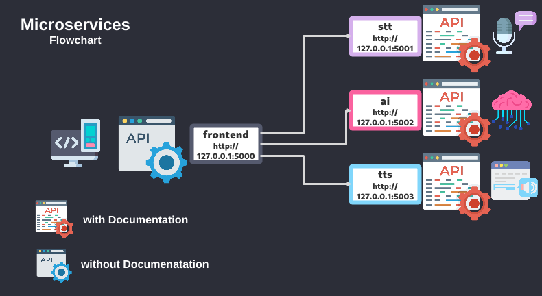

Ai
==

### Run:
```
cd Microservices/microservices_ai && \
docker-compose up --build

docker-compose down && \
docker rmi $(docker images --format="{{.ID}}" microservices-ai_*) --force && \
docker volume prune
```

