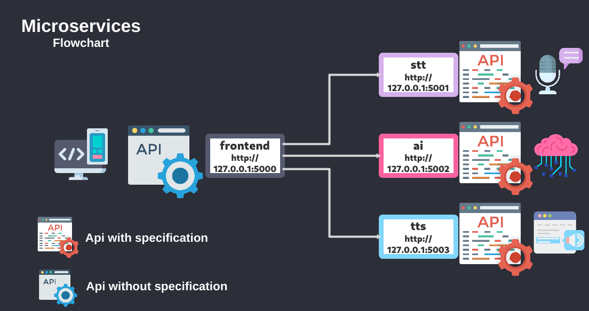

Microservices Ai
================

### Run:
```
git clone https://github.com/Martin1403/Microservices.git 
cd Microservices/microservices_ai && \
docker-compose up --build
```
**Note:**
###### [Link](https://github.com/Martin1403/Tensorflow-1.1X/tree/master/chatbot_with_memory) train your own ai-model ...
###### [Link](https://github.com/Martin1403/Tensorflow-1.1X/tree/master/deepspeech_train) train your own stt-model ...
