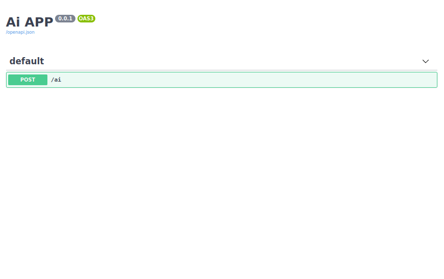

Ai 
==

###### venv: python3.7
###### /
```
python -m venv ai/.venv && \
source ai/.venv/bin/activate && \
pip install -U pip && \
pip install -r ai/requirements.txt
```
### Run:
###### /
```
source ai/.venv/bin/activate && \
export QUART_APP=ai.app:app && \
export QUART_ENV=development && \
quart run -h "127.0.0.1" -p 5002
```
### Tests:
###### /
- ###### Test async:
    ````
    export QUART_APP=ai.app:app && \
    export QUART_ENV=development && \
    quart test-async
    ````
### Docker:
###### /ai
```
docker build -t ai . && \
docker run -it --rm -p 5002:5002 ai && \
docker rmi ai --force
```
**Note:**
###### Help:
- ###### / inside root directory or cd /xxx  
###### [Links:]()
- ###### [Link](https://github.com/Martin1403/Tensorflow1.15.x-MemoryNetwork), train with your own data...
