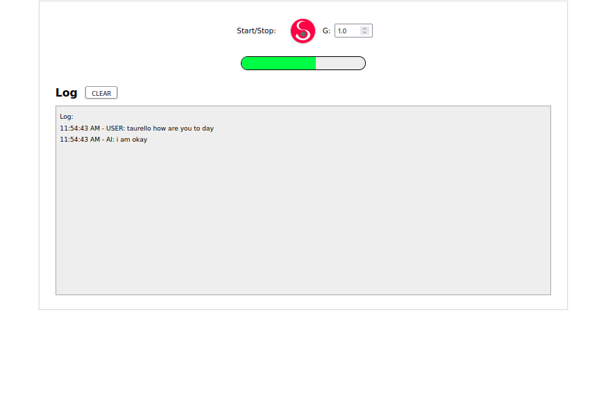

Frontend   

========
###### venv: python3.9
###### /
```
python -m venv frontend/.venv && \
source frontend/.venv/bin/activate && \
pip install -U pip && \
pip install -r frontend/requirements.txt
```
### Run:
###### /
```
source frontend/.venv/bin/activate && \
export QUART_APP=frontend.app:app && \
export QUART_ENV=development && \
quart run -h "127.0.0.1" -p 5000
```
### Docker:
###### /frontend
```
docker build -t frontend . && \
docker run -it --rm -p 5000:5000 frontend && \
docker rmi frontend --force
```
**Note:** 
###### Help:
- ###### / inside root directory or cd /xxx  
###### [Links:]()  
- ###### [Link](https://github.com/SEPIA-Framework/sepia-web-audio) to Sepia vad audio ...


