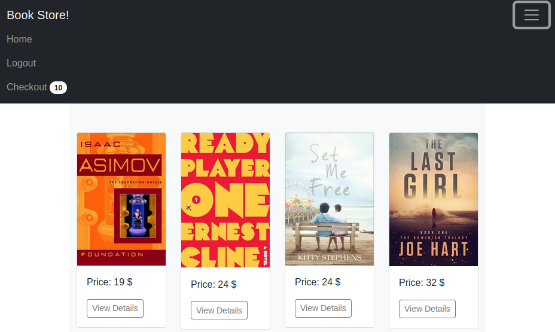

Microservices with Flask & SQLAlchemy
=====================================



#### Run with docker-compose
- 1 Run:
```shell
docker-compose up
```
- 2 Click:

[frontend-page](http://127.0.0.1:5000)
- 3 Run:
```shell
docker-compose down
```