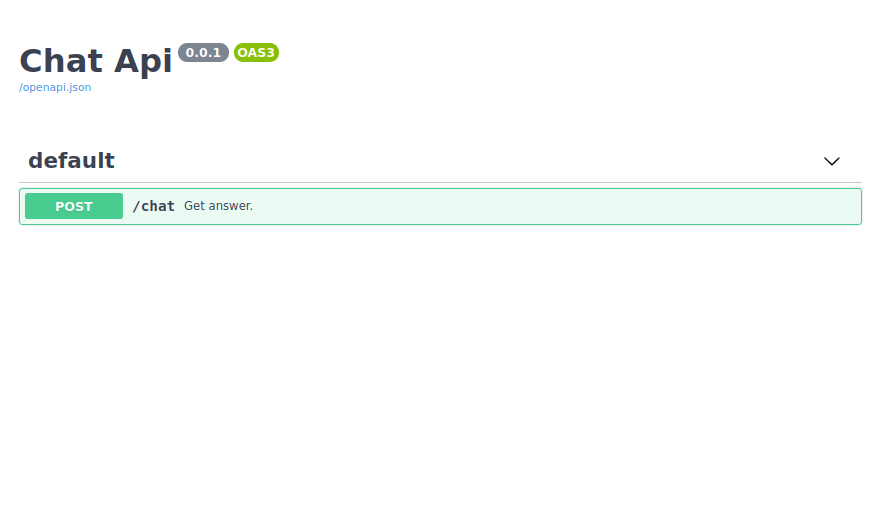

Ai Quart app
============

### Venv:
###### python3.6-7
###### /ai
```shell
python -m venv .venv && \                                                     
source .venv/bin/activate && \
pip install -U pip && \
pip install -r requirements.txt
```
### Run:
###### /
```shell
export QUART_APP=ai.app:app && \
export QUART_ENV=development && \
quart run -h "127.0.0.1" -p 5002
```
### Click commands:
###### /
- ##### Test async:
  - ##### Future implementations:
    ```shell
    export QUART_APP=ai.app:app && \
    export QUART_ENV=development && \
    quart test-async
    ```
  - ##### Test async Chat:
    ```shell
    export QUART_APP=ai.app:app && \
    export QUART_ENV=development && \
    quart test-async-chat
    ```
### Docker:
###### /ai
```shell
docker build -t ai . && \
docker run -it --rm -p 5002:5002 ai && \
docker rmi ai --force
```
### Links:
- #### Train:
  ###### [GitHub](https://github.com/Martin1403/Tensorflow1.15.x-MemoryNetwork) If you want to train your own model...
