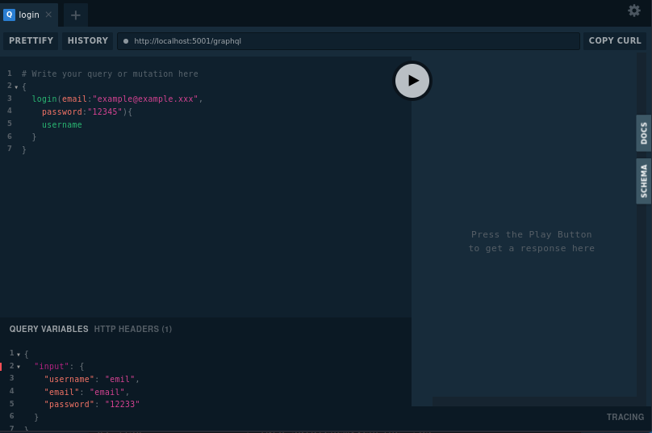

Chat Quart app
==============

### Venv:
###### python3.7-9
###### /chat
```shell
python -m venv .venv && \                                                     
source .venv/bin/activate && \
pip install -U pip && \
pip install -r requirements.txt
```
### Run:
###### /
```shell
export QUART_APP=chat.app:app && \
export QUART_ENV=development && \
quart run -h "127.0.0.1" -p 5001
```
### Click commands:
###### /

- ##### Test async:
  - ##### Future implementations:
    ```shell
    export QUART_APP=chat.app:app && \
    export QUART_ENV=development && \
    quart test-async
    ```
- ##### Database:
  - ###### Initialize database: 
    ```shell
    export QUART_APP=chat.app:app && \
    export QUART_ENV=development && \
    quart init-db
    ```
  - ###### Test database:
    ```shell
    export QUART_APP=chat.app:app && \
    export QUART_ENV=development && \
    quart test-db
    ```
  - ###### Test data access layer:
    ```shell
    export QUART_APP=chat.app:app && \
    export QUART_ENV=development && \
    quart test-dal      
    ```
### Docker:
###### /chat
```shell
docker build -t chat . && \
docker run -it --rm -p 5001:5001 chat && \
docker rmi chat --force
```
