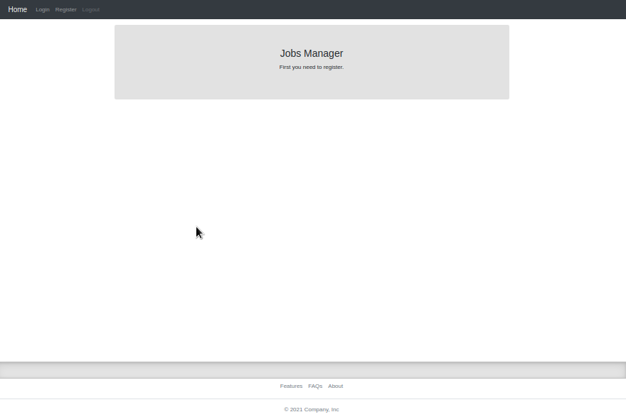

Flask Frontend
==============
- ###### / 
  

### Venv:
###### python3.7-9
###### /frontend
```shell
python -m venv .venv && \
source .venv/bin/activate && \
pip install -U pip && \
pip install -r requirements.txt
```
### Run:
###### /
```shell
export FLASK_ENV=development && \
export FLASK_APP=frontend && \
export FLASK_RUN_HOST=127.0.0.1 && \
export FLASK_RUN_PORT=5000 && \
flask run
```
### Docker:
###### /frontend
```shell
docker build -t frontendapp . && \ 
docker run -it --rm -p 5000:5000 frontendapp && \
docker rmi frontendapp --force
```