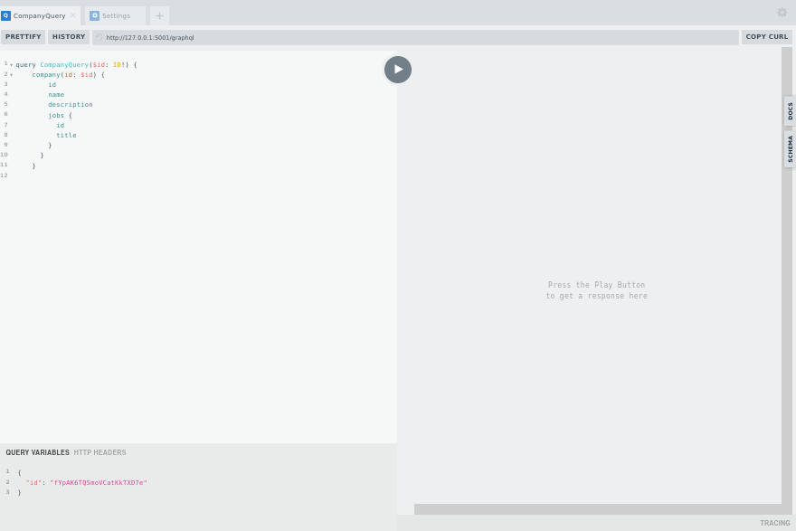

GraphQL REST-API
================
- ###### /graphql
  
  

### Venv:
###### Python3.7-9
###### /jobs
```shell
python -m venv .venv && \
source .venv/bin/activate && \
pip install -U pip && \
pip install -r requirements.txt
```
### Run:
###### /
```shell
export FLASK_ENV=development && \
export FLASK_APP=jobs && \
flask init-db && \
flask test-db && \
flask test-dal && \
flask db init && \
flask db migrate -m "initial" && \ 
flask db upgrade && \
flask db migrate -m "some data" && \ 
export FLASK_RUN_HOST=127.0.0.1 && \
export FLASK_RUN_PORT=5001 && \
flask run
```
### Database:
###### /
- #### Migrations:
```shell
export FLASK_APP=jobs && \
flask db init && \
flask db migrate -m "initial" && \ 
flask db upgrade
```
- #### Tests:
  - ###### Recreate:
    ```shell
    export FLASK_APP=jobs && \
    flask init-db
    ```
  - ###### Populate:
    ```shell
    export FLASK_APP=jobs && \
    flask test-db 
    ```
  - ###### Testing data access layer:
    ```shell
    export FLASK_APP=jobs && \
    flask test-dal
    ```
    
### Docker:
###### /
```shell
docker build -t jobsapp . && \ 
docker run -it --rm -p 5001:5001 jobsapp && \
docker rmi jobsapp --force
```