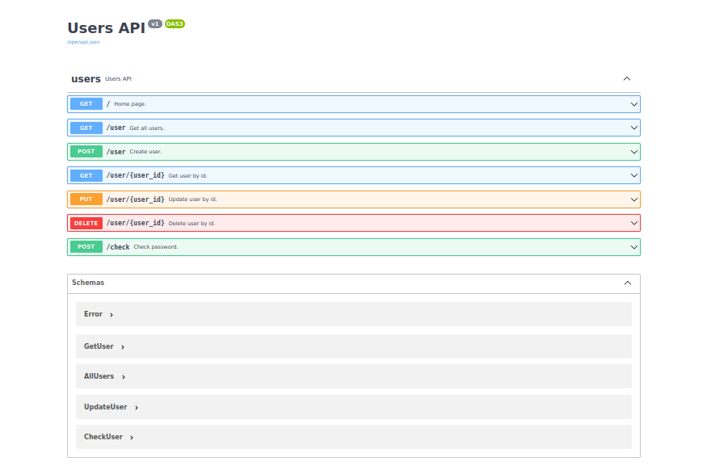

Flask REST API
==============
- ###### /docs 
  

### Venv:
###### python3.7-9:
###### /users
```shell
python -m venv .venv && \
source .venv/bin/activate && \
pip install -U pip && \
pip install -r requirements.txt 
```
### Run:
###### /
```shell
export FLASK_ENV=development && \
export FLASK_APP=users && \
export FLASK_RUN_HOST=127.0.0.1 && \
export FLASK_RUN_PORT=5002 && \
flask run
```
### Docker:
###### /users
```shell
docker build -t users . && \
docker run --rm -it -p 5002:5002 users && \
docker rmi users --force && \
```