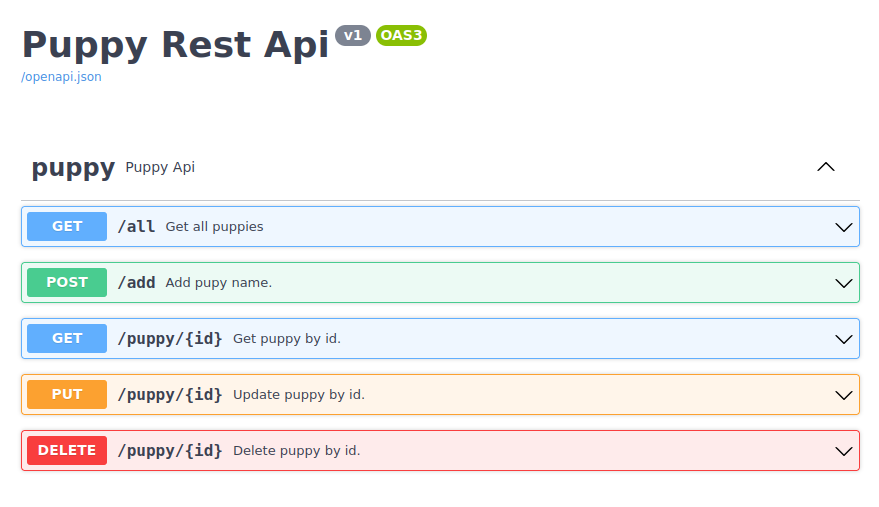

Puppy Rest Api
==============


### Venv:
###### python3.9
###### /puppy
```shell
python -m venv .venv
source .venv/bin/activate
pip install -r requirements.txt
```
### Run:
###### /
```shell
export FLASK_ENV=development && \
export FLASK_APP=puppy && \   
flask run --reload -h localhost -p 5001
```
### Database:
###### /
```shell
flask db init 
flask db migrate -m "initial" 
flask db upgrade   
flask run --reload
```
### Docker:
###### /puppy
```shell
docker build -t puppy . && \
docker run -it -p 5000:5000 --rm puppy && \
docker rmi frontend --force
```